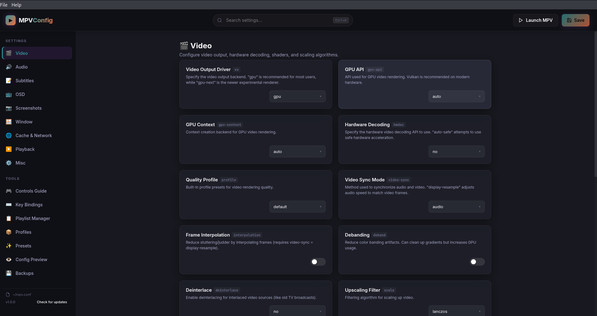
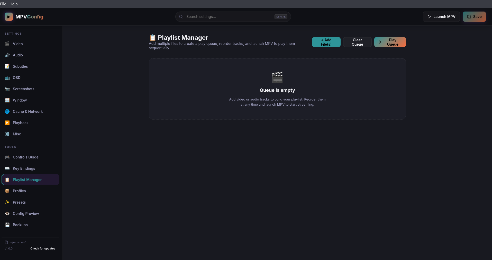
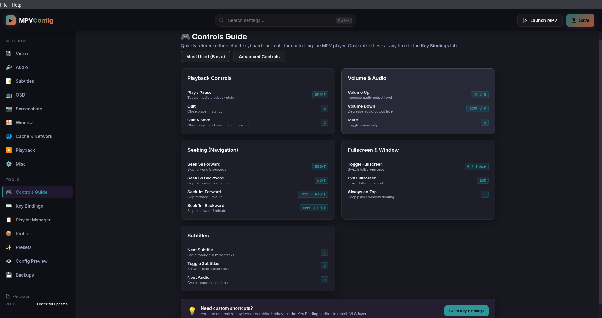
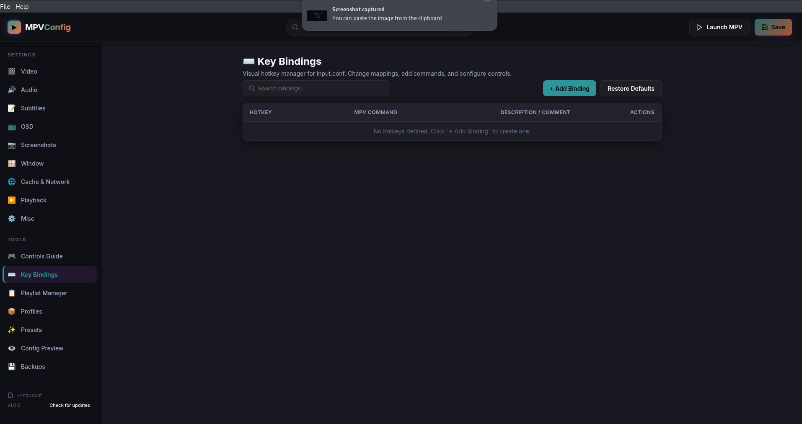
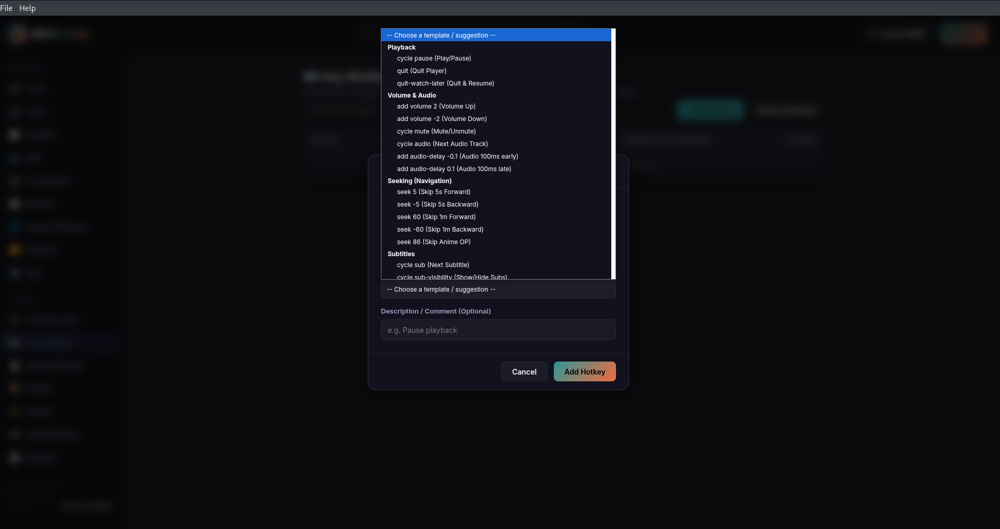
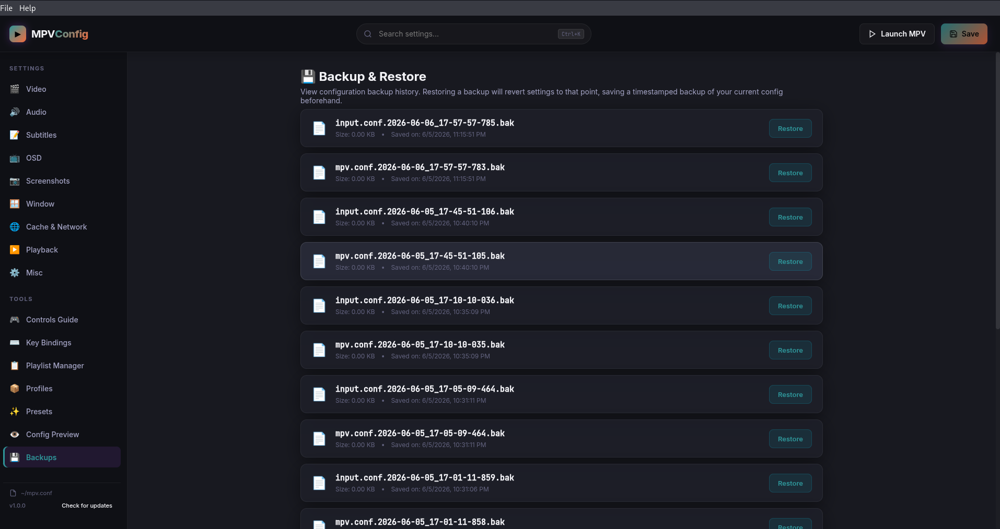

# MPV Config Manager

A premium, dark-themed Electron desktop application to manage settings, hotkeys, and playlists for the **MPV Media Player** visually.

This utility serves as a standalone companion app for the official MPV player, letting users edit configurations (`mpv.conf` and `input.conf`) through a modern GUI rather than manually modifying text files.

---

## 📸 Visual Showcase
*Place your captured screenshots inside the `/screenshots` directory with these filenames to render them here:*

| | |
| :---: | :---: |
| **Main Dashboard & Settings**<br> | **Interactive Playlist Manager**<br> |
| **Controls Guide Cheat Sheet**<br> | **Hotkey Bindings Manager**<br> |
| **Command Suggestions Helper**<br> | **Automatic Backups History**<br> |

---

## Features

- 🎬 **Tabbed Settings Categories**: Visual controls (switches, dropdowns, ranges, color pickers, and paths) for Video, Audio, Subtitles, OSD, Screenshots, Window, Cache/Network, Playback, and Misc.
- 📋 **Playlist Manager**: Bulk-add media files, drag/click to reorder, clear queues, and spawn MPV to play them sequentially.
- ⌨️ **Hotkey Editor**: Visual lookup and manager for `input.conf` with a commands suggestions dropdown containing structured hotkey templates.
- 🎮 **Controls Guide**: A cheat sheet divided into basic and advanced shortcuts, with quick jump links to the hotkey editor.
- 💾 **Automatic Backups**: Creates timestamped file backups in `~/.config/mpv/backups/` before saving, with a one-click restore history view.
- ✨ **Preset Profiles**: Apply presets (High Quality, Fast Performance, Anime Optimized, Low Latency, or Defaults) instantly.
- 🔍 **Global Search**: Search settings by name, keyword, or description, with automatic scrolling and glowing card animations.
- 🖥️ **System Info**: Detects your OS, GPU, display, audio devices, and MPV version to preview hardware compatibility before player launch.

---

## 📦 Download Distributables
To run the pre-built application on Linux without running from source:
- **Debian / Kali Linux (`.deb` package)**: Go to the GitHub Releases page to download `mpv-settings-gui_1.0.0_amd64.deb` and install it:
  ```bash
  sudo dpkg -i mpv-settings-gui_1.0.0_amd64.deb
  ```
- **Portable AppImage (`.AppImage` executable)**: Download `MPVConfig-1.0.0.AppImage`, mark it executable, and run:
  ```bash
  chmod +x MPVConfig-1.0.0.AppImage
  ./MPVConfig-1.0.0.AppImage
  ```

---

## Installation & Setup (For Developers)

Ensure you have **Node.js** (v18+) and **npm** installed on your system.

1. **Clone the repository**:
   ```bash
   git clone https://github.com/shohan-001/mpv-settings-gui.git
   cd mpv-settings-gui
   ```

2. **Install dependencies**:
   ```bash
   npm install
   ```

3. **Start the application**:
   ```bash
   npm start
   ```

4. **Build release packages**:
   ```bash
   npm run dist
   ```

---

## Credits & Attributions

This project is a visual settings wrapper designed as a companion for the **MPV Media Player**.

- Core Player: [mpv-player/mpv](https://github.com/mpv-player/mpv)
- MPV official website: [mpv.io](https://mpv.io)
